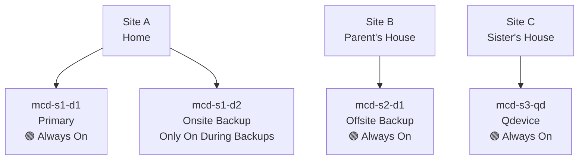

# Cluster

## Magic Cluster


```mermaid
graph TD

z["Site A
Home"]
q["Site B
Parent's House"]
y["Site C
Sister's House"]

d["mcd-s1-d1
Primary
🟢 Always On
"]
f["mcd-s1-d2
Onsite Backup
Only On During Backups
"]
e["mcd-s3-qd
Qdevice
🟢 Always On
"]
a["mcd-s2-d1
Offsite Backup
🟢 Always On
"]


z-->d
z-->f
q-->a
y-->e

```

```bash
magic-cluster

mcd-s1-primary
mcd-s1-backup
mcd-s1-non-production
mcd-s2-secondary
mcd-s3-qdevice
mcd-s4-d1
```

Create cluster

Add each node
