# High Availability

### Legend

🟢 Online 🔴 Offline 🖥️ VM

## Normal Operation

```mermaid
graph TD
siteA[Site A]-->Home["🟢 Node Home Primary
🟢 VM 🖥️"]
siteB[Site B]-->Qdevice[🟢 Qdevice]
siteC[Site C]-->Farm[🟢 Node Farm Primary]
```

## Site Outage

### VM is down

Qdevice notices Primary is down

```mermaid
graph LR
Farm[🟢 Secondary]<-->Qdevice["🟢 Qdevice"]-->Home["🔴 Primary
🔴 VM 🖥️"]
```

### VM is Up

Qdevice starts VM on Secondary

```mermaid
graph LR
Farm["🟢 Secondary
🟢 VM 🖥️"]<-->Qdevice["🟢 Qdevice"]-->Home["🔴 Primary
"]
```

Create replication pool

Migrating VMs

Setting up failover

