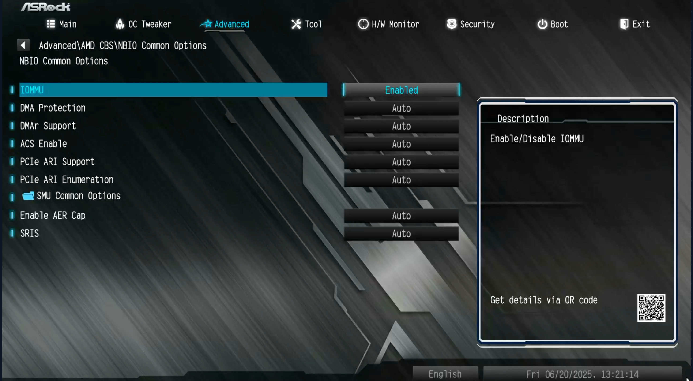

# BIOS

## Main

Ensure: BIOS version is the same accross all units.
[Get BIOS versions here](https://www.asrock.com/mb/AMD/B550M%20Pro4/index.asp#BIOS)

### Time

Ensure:

Time is accurate. Timezone diffrences may affect hh:mm:ss even is date is correct.

### Advanced\PCI

Ensure:

All are enabled.

### Advanced\Onboard Devices

Ensure:

Restore on AC/Power Loss = Power on

Onboard LAN = Enabled

### Advanced\Storage

Ensure:

SATA Hot Plug = Enabled

### Advanced\ACPI

Ensure:

PCIE Devices Power On = Enabled

RTC Alarm Power On = By OS

USB Power delivery in Soft Off state = Enabled

### Advanced\AMD PBS

Ensure:

PCIe/GFX Lanes Config = x16

PCIe x16 Bus Interface = Auto

### Advanced\AMD CBS\CPU Common

Ensure:

Power Supply Idle Control = Low Current Idle

### Advanced\AMD CBS\NBIO Common

Ensure:

IOMMU = Enabled

All other options = Auto

## Security\Secure Boot

Ensure:

Secure Boot = Disabled

