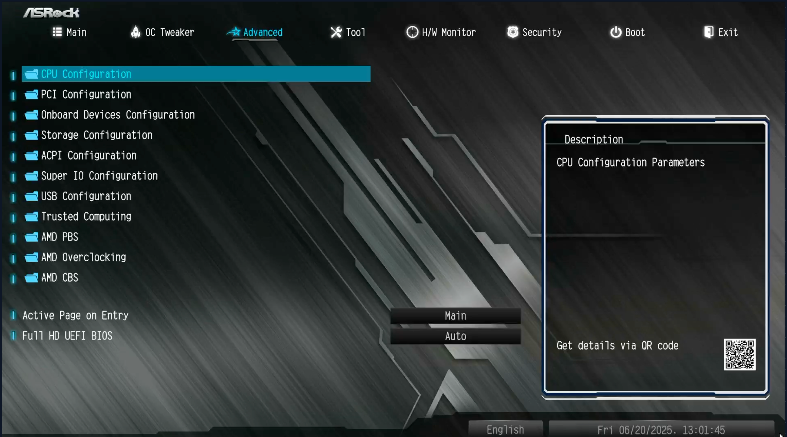

# My Cool Project

Here’s a little workflow:


And here’s the install script:

```bash
#!/usr/bin/env bash
set -e

echo "Updating package list…"
sudo apt update

echo "Installing nginx…"
sudo apt install -y nginx

echo "Done!"
```




