# BIOS

Set as shown:

## Main

Ensure BIOS version is the same accross all units.
[Get BIOS versions here](https://www.asrock.com/mb/AMD/B550M%20Pro4/index.asp#BIOS)

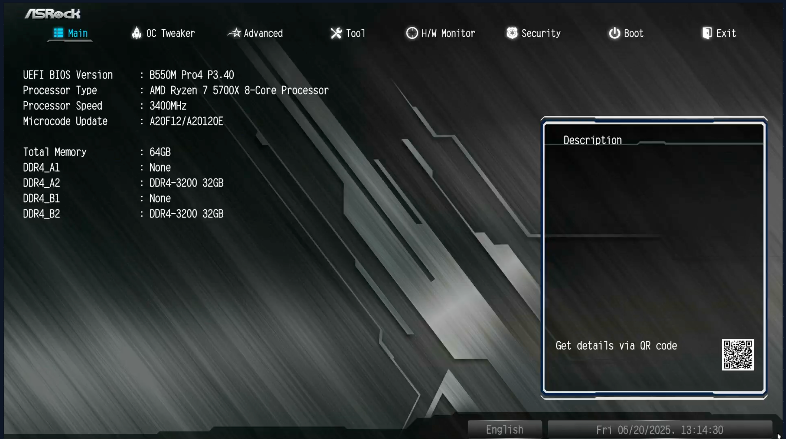

### Time

Make sure time is accurate. Timezone diffrences may affect hh:mm:ss even is date is correct.

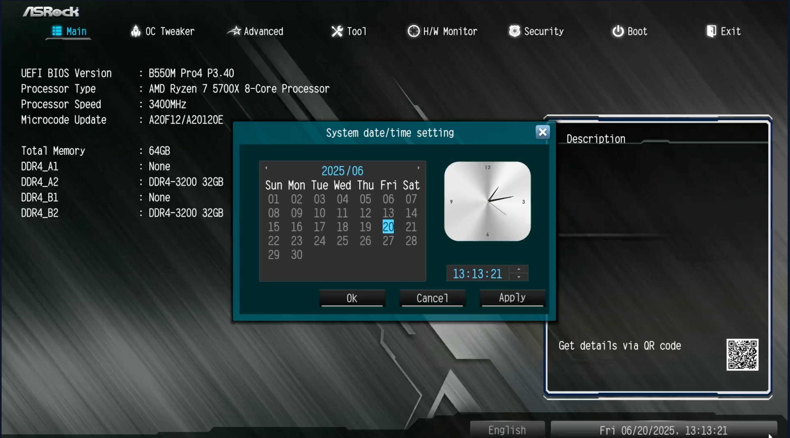

## Advanced

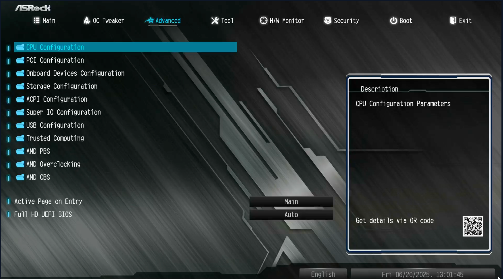

### Advanced\PCI

Enable all.

### Advanced\Onboard Devices

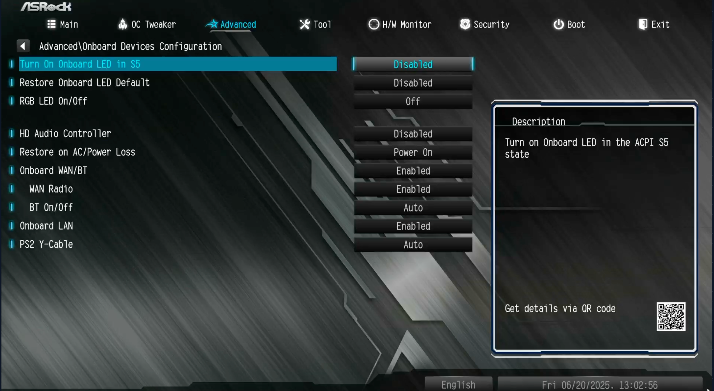

### Advanced\Storage

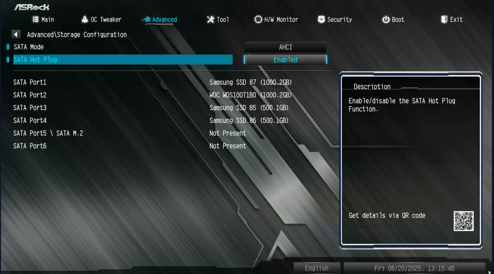

### Advanced\ACPI

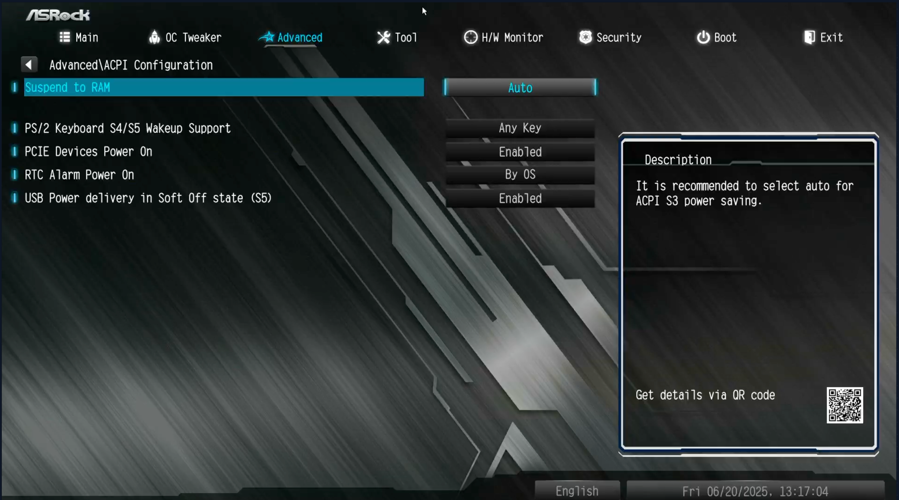

### Advanced\AMD PBS

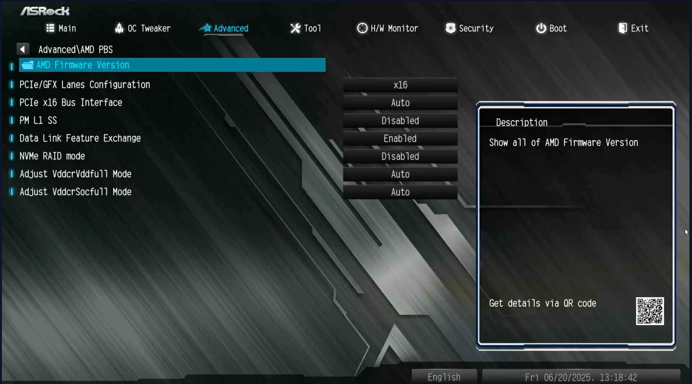

### Advanced\AMD CBS\CPU Common

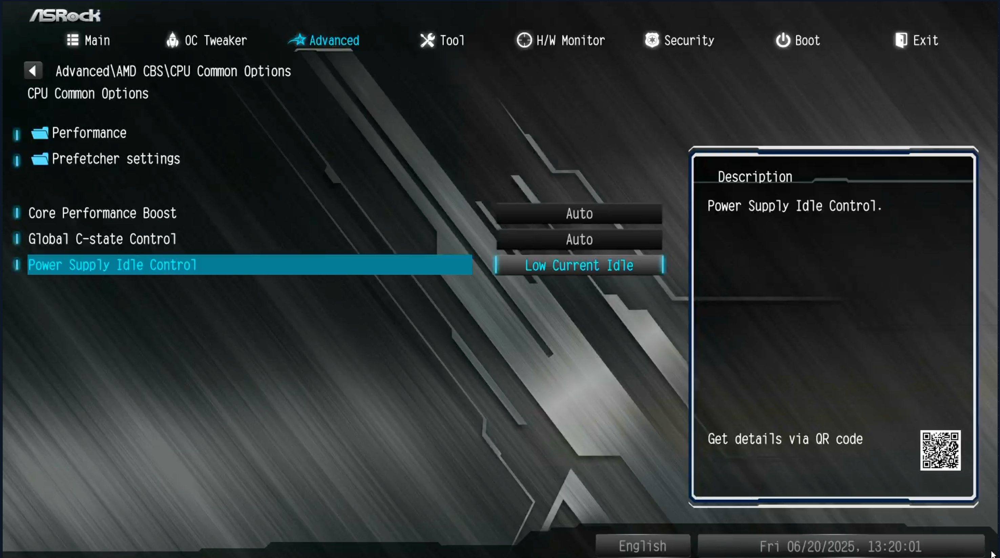

### Advanced\AMD CBS\NBIO Common

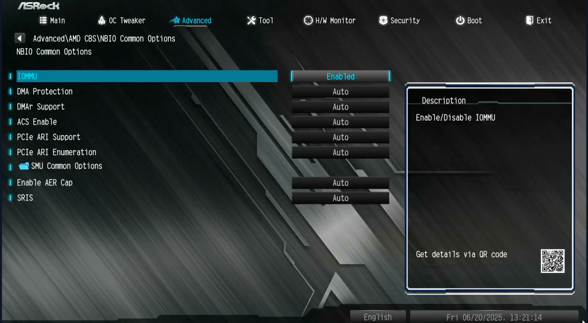

## Security

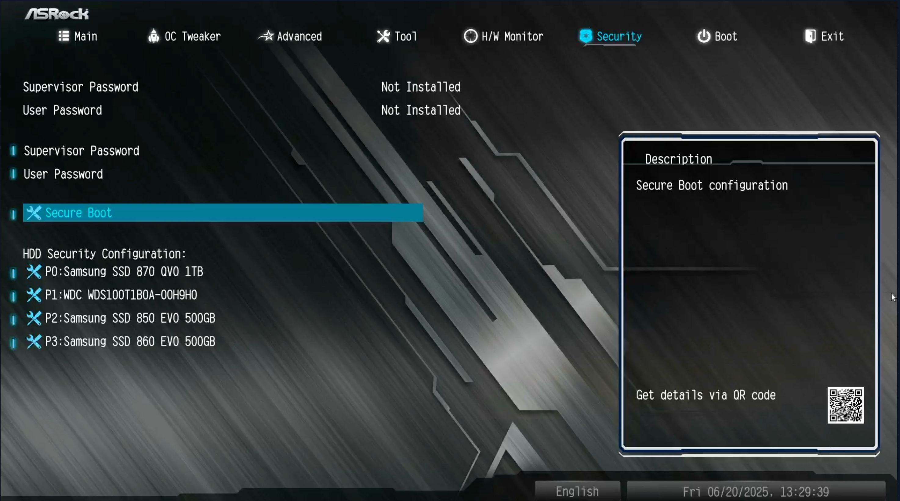

## Security\Secure Boot

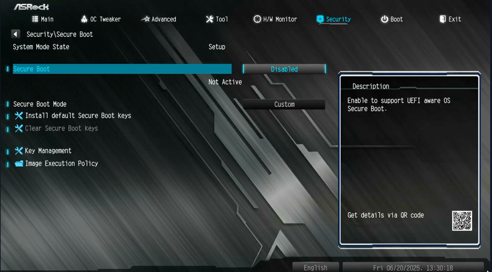
