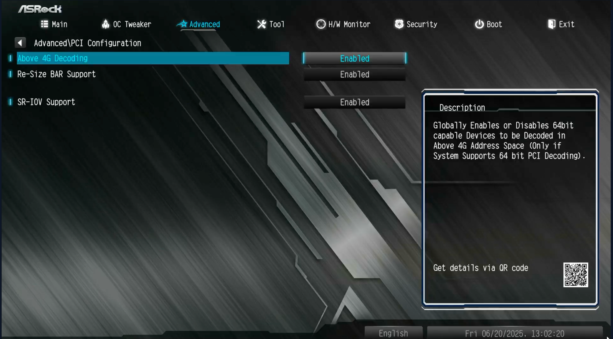

# BIOS

Set as shown:

## Main

Ensure BIOS version is the same accross all units.
[Get BIOS versions here](https://www.asrock.com/mb/AMD/B550M%20Pro4/index.asp#BIOS)

### Time

Make sure time is accurate. Timezone diffrences may affect hh:mm:ss even is date is correct.

## Advanced

### PCI

### Onboard Devices

### Storage

### ACPI

### AMD PBS

