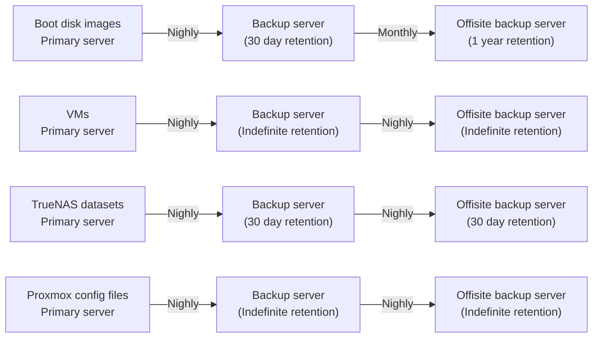
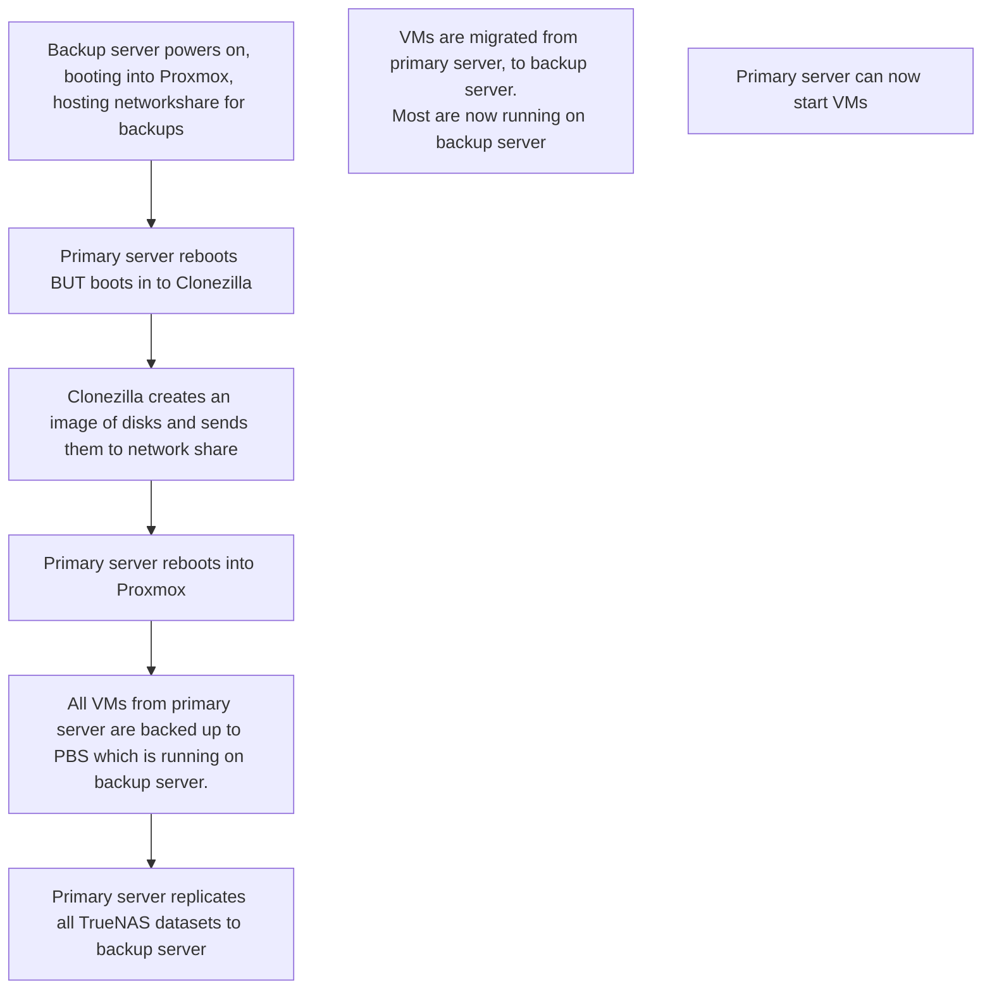

# Backups

## What's being backed up and to where

```mermaid
graph LR
a["Boot disk images
Primary server"]
d["Backup server 
(30 day retention)"]
j["Offisite backup server
(1 year retention)"]
a-->|"Nighly"|d-->|"Monthly"|j
e["VMs
Primary server"]
f["Backup server 
(Indefinite retention)"]
k["Offisite backup server
(Indefinite retention)"]
e-->|"Nighly"|f-->|"Nighly"|k
g["TrueNAS datasets
Primary server"]
h["Backup server 
(30 day retention)"]
l["Offisite backup server
(30 day retention)"]
g-->|"Nighly"|h-->|"Nighly"|l
m["Proxmox config files
Primary server"]
n["Backup server 
(Indefinite retention)"]
o["Offisite backup server
(Indefinite retention)"]
m-->|"Nighly"|n-->|"Nighly"|o

```

## Nightly Backup Granular Flowchart

```mermaid
graph TD
a[Backup server powers on, booting into Proxmox, hosting networkshare for backups]
k["VMs are migrated from primary server, to backup server.
Most are now running on backup server"]
d[Primary server reboots BUT boots in to Clonezilla]
a-->d
e[Clonezilla creates an image of disks and sends them to network share]
d-->e
g[Primary server reboots into Proxmox]
e-->g
h[All VMs from primary server are backed up to PBS which is running on backup server.]
g-->h
j[Primary server can now start VMs]
i[Primary server replicates all TrueNAS datasets to backup server]
h-->i
```
