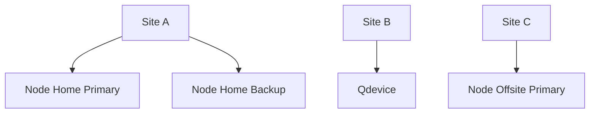
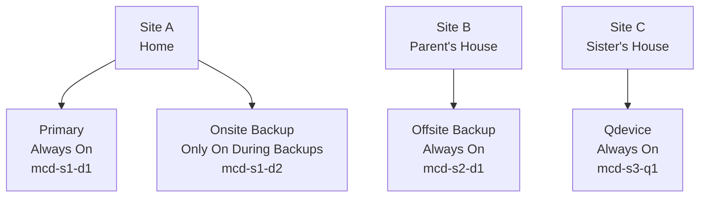

# Cluster

## Cluster Structure



Create cluster on primay node

Command:

```bash

```

magic-cluster

pve-magic-1-site-1-primary
pve-magic-2-site-1-backup
pve-magic-3-site-2-primary

magic-cluster

node-site-device
n1-s1-d1
n2-s1-d2
n3-s2-d1
n4-s3-d1

magic-cluster

magic-n1-s1-d1
magic-n2-s1-d2
magic-n3-s2-d1
magic-n4-s3-d1

magic-cluster

magic-s1-d1
magic-s1-d2
magic-s2-d1
magic-s3-d1

## Magic Cluster



```bash
magic-cluster

mcd-s1-d1
mcd-s1-d2
mcd-s1-d3
mcd-s2-d1
mcd-s3-q1
mcd-s4-d1
```

