# High Availability

### Legend

🟢 Online 🔴 Offline 🖥️ VM

## Normal Operation

```mermaid
graph TD
siteA[Site A]-->Home["🟢 Node Home Primary
🟢 VM 🖥️"]
siteB[Site B]-->Qdevice[🟢 Qdevice]
siteC[Site C]-->Farm[🟢 Node Farm Primary]
```

## Site Outage

### VM is down

```mermaid
graph TD
siteA[Site A]-->Home["🔴 Node Home Primary
🔴 VM 🖥️"]
siteB[Site B]-->Qdevice[🟢 Qdevice]
siteC[Site C]-->Farm[🟢 Node Farm Primary]
```

Qdevice notices Site A is Down, VM is Started on Other Node within 4 Minutes

After 4 Minutes VM is Operational

### VM is Up

```mermaid
graph TD
siteA[Site A]-->Home["🔴 Node Home Primary"]
siteB[Site B]-->Qdevice[🟢 Qdevice]
siteC[Site C]-->Farm["🟢 Node Farm Primary
🟢 VM 🖥️"]
```

