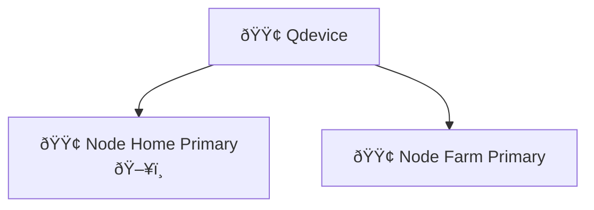
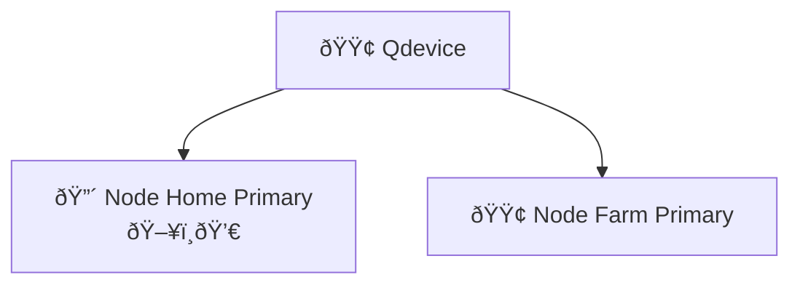
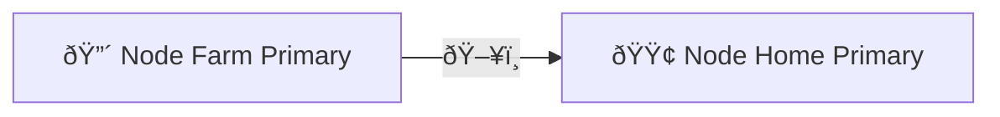
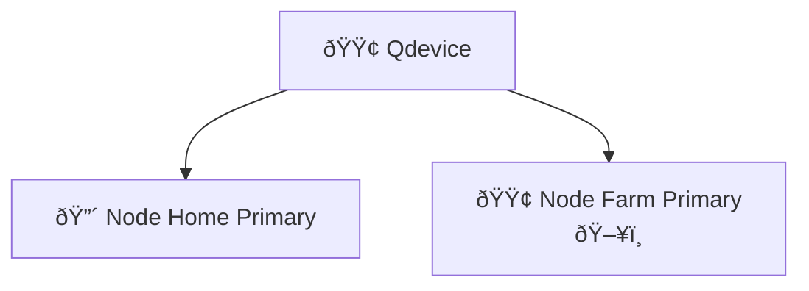

# HA

## Legend

🟢 Online 🔴 Offline ðŸ–¥ï¸ VM

## Normal operation

```mermaid
graph TD
a[🟢 Qdevice]
d["🟢 Node Home Primary
🖥ï¸"]
e[🟢 Node Farm Primary]

a-->d
a-->e

```

## Node goes offline

### VM is down

```mermaid
graph TD
a[🟢 Qdevice]
d["🔴 Node Home Primary
🖥ï¸ðŸ’€"]
e[🟢 Node Farm Primary]
a-->d
a-->e

```

### VM Migrates

```mermaid
graph LR
d[🟢 Node Home Primary]
e[🔴 Node Farm Primary]
e-->|"🖥ï¸"|d

```

### VM Is Running on Other Node

```mermaid
graph TD
a[🟢 Qdevice]
d[🔴 Node Home Primary]
e["🟢 Node Farm Primary
🖥ï¸"]
a-->d
a-->e

```