# High Availability

## Legend

🟢 Online 🔴 Offline 🖥️ VM

## Normal Operation

```mermaid
graph TD
a[🟢 Qdevice]
d["🟢 Node Home Primary
🟢 VM 🖥️"]
e[🟢 Node Farm Primary]

a-->d
a-->e

```

## Home Node is Down

### VM is Down

```mermaid
graph TD
a[🟢 Qdevice]
d["🔴 Node Home Primary
🔴 VM 🖥️"]
e[🟢 Node Farm Primary]
a-->d
a-->e

```

### VM Migrates with Downtime of 4 Minutes

```mermaid
graph LR
d["🟢 Node Home Primary 
🟢 VM 🖥️"]
e["🔴 Node Farm Primary
🔴 VM 🖥️"]
e-->|"4 minute migration
🔴 VM 🖥️"|d

```

### VM Running on Other Node

```mermaid
graph TD
a[🟢 Qdevice]
d[🔴 Node Home Primary]
e["🟢 Node Farm Primary
🟢 VM 🖥️"]
a-->d
a-->e

```

