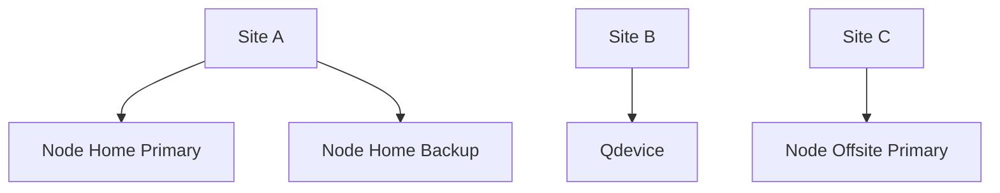

# Backups

## Nightly Backup Granular Flowchart

```mermaid
graph TD

z[Site A]
q[Site B]
y[Site C]

d[Node Home Primary]
a[Qdevice]
e[Node Offsite Primary]

f[Node Home Backup]

z-->d
z-->f
q-->a
y-->e

```
