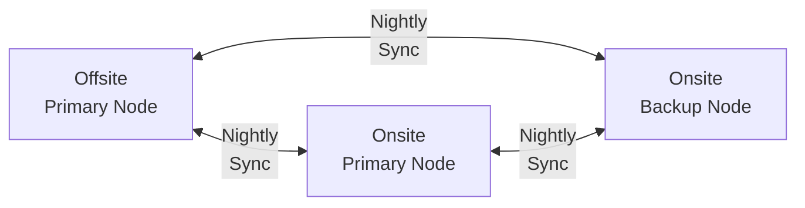

# Backups

## Mass Storage Backups

## VM Backups

## Data Backed Up and Tool Used

VM and Hypervisor Data

Proxmox Backup Server

Media and Personal Files

TrueNAS Replication

SyncThing

3-Way-Sync

Using a 3-1-1 backup stratergy

3 copies of data. 1 medium. 1 copy stored offsite.

## Restoring Data

