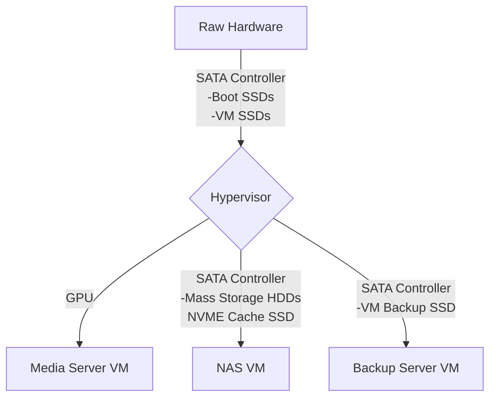
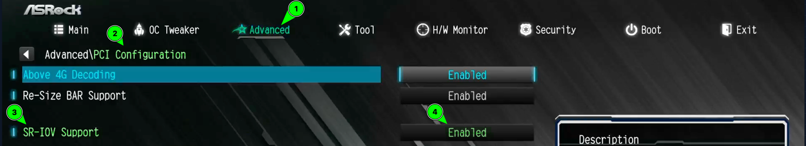
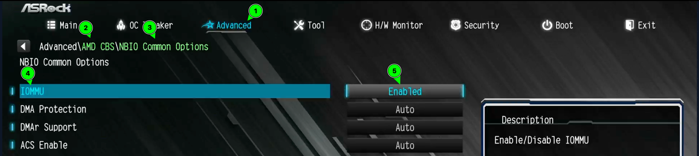
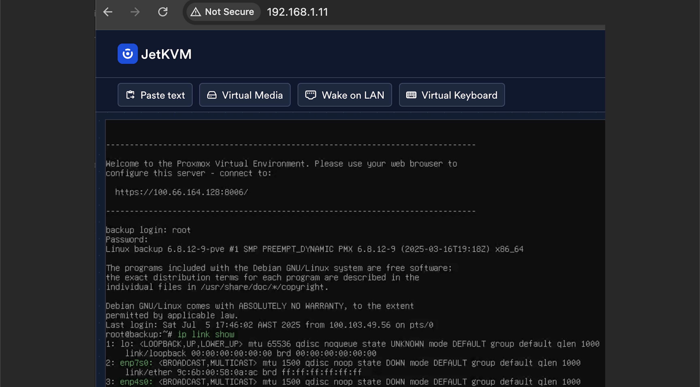

# PCI Passthrough

##



## Enable in BIOS

#### Ensure SR-IOV Support is enabled:



#### Ensure IOMMU is enabled:



## Enable in Proxmox

### Enable IOMMU

Command:

```bash
nano /etc/kernel/cmdline
```

Set File Contents:

```bash
root=ZFS=rpool/ROOT/pve-1 boot=zfs amd_iommu=on iommu=pt pcie_acs_override=downstream,multifunction
```

Command:

```bash
proxmox-boot-tool refresh
```

### Load VFIO Modules at Boot

Command:

```bash
nano /etc/modules
```

Set File Contents:

```bash
# /etc/modules: kernel modules to load at boot time.
#
# This file contains the names of kernel modules that should be loaded
# at boot time, one per line. Lines beginning with "#" are ignored.
# Parameters can be specified after the module name.

vfio
vfio_iommu_type1
vfio_pci
vfio_virqfd
```

## Get the Device PCI Address

Command:

```bash
lspci
```

Abridged Output:

```bash
01:00.0 USB controller: Advanced Micro Devices, Inc. [AMD] 500 Series Chipset USB 3.1 XHCI Controller
01:00.1 SATA controller: Advanced Micro Devices, Inc. [AMD] 500 Series Chipset SATA Controller
01:00.2 PCI bridge: Advanced Micro Devices, Inc. [AMD] 500 Series Chipset Switch Upstream Port
03:00.0 Ethernet controller: Aquantia Corp. AQC107 NBase-T/IEEE 802.3bz Ethernet Controller [AQtion] (rev 02)
04:00.0 SATA controller: JMicron Technology Corp. JMB58x AHCI SATA controller
05:00.0 SATA controller: ASMedia Technology Inc. ASM1064 Serial ATA Controller (rev 02)
06:00.0 Ethernet controller: Realtek Semiconductor Co., Ltd. RTL8111/8168/8411 PCI Express Gigabit Ethernet Controller (rev 15)
07:00.0 SATA controller: JMicron Technology Corp. JMB58x AHCI SATA controller
0a:00.0 VGA compatible controller: Intel Corporation DG2 [Arc A310] (rev 05)
0d:00.3 USB controller: Advanced Micro Devices, Inc. [AMD] Matisse USB 3.0 Host Controller
```

The PCI address is located at the start of each line

E.g. '0a:00.0' for Arc A310

```bash
0a:00.0 VGA compatible controller: Intel Corporation DG2 [Arc A310] (rev 05) VGA compatible 
```

## Confirm the IOMMU Group is Isolated

It is only possible to passthrough devices by passing through the entire group.

Ensure the the device that you want to passthrough does NOT share it's IOMMU group with any other devices.

Command:

```bash
find /sys/kernel/iommu_groups/ -type l
```

Output:

```bash
/sys/kernel/iommu_groups/17/devices/0000:02:04.0
/sys/kernel/iommu_groups/7/devices/0000:00:07.0
/sys/kernel/iommu_groups/25/devices/0000:07:00.0
/sys/kernel/iommu_groups/15/devices/0000:01:00.2
/sys/kernel/iommu_groups/33/devices/0000:0d:00.1
/sys/kernel/iommu_groups/5/devices/0000:00:04.0
/sys/kernel/iommu_groups/23/devices/0000:05:00.0
/sys/kernel/iommu_groups/13/devices/0000:01:00.0
/sys/kernel/iommu_groups/31/devices/0000:0c:00.0
/sys/kernel/iommu_groups/3/devices/0000:00:03.0
/sys/kernel/iommu_groups/21/devices/0000:03:00.0
/sys/kernel/iommu_groups/11/devices/0000:00:14.3
/sys/kernel/iommu_groups/11/devices/0000:00:14.0
/sys/kernel/iommu_groups/1/devices/0000:00:01.2
/sys/kernel/iommu_groups/28/devices/0000:09:04.0
/sys/kernel/iommu_groups/18/devices/0000:02:06.0
/sys/kernel/iommu_groups/8/devices/0000:00:07.1
/sys/kernel/iommu_groups/26/devices/0000:08:00.0
/sys/kernel/iommu_groups/16/devices/0000:02:00.0
/sys/kernel/iommu_groups/34/devices/0000:0d:00.3
/sys/kernel/iommu_groups/6/devices/0000:00:05.0
/sys/kernel/iommu_groups/24/devices/0000:06:00.0
/sys/kernel/iommu_groups/14/devices/0000:01:00.1
/sys/kernel/iommu_groups/32/devices/0000:0d:00.0
/sys/kernel/iommu_groups/4/devices/0000:00:03.1
/sys/kernel/iommu_groups/22/devices/0000:04:00.0
/sys/kernel/iommu_groups/12/devices/0000:00:18.3
/sys/kernel/iommu_groups/12/devices/0000:00:18.1
/sys/kernel/iommu_groups/12/devices/0000:00:18.6
/sys/kernel/iommu_groups/12/devices/0000:00:18.4
/sys/kernel/iommu_groups/12/devices/0000:00:18.2
/sys/kernel/iommu_groups/12/devices/0000:00:18.0
/sys/kernel/iommu_groups/12/devices/0000:00:18.7
/sys/kernel/iommu_groups/12/devices/0000:00:18.5
/sys/kernel/iommu_groups/30/devices/0000:0b:00.0
/sys/kernel/iommu_groups/2/devices/0000:00:02.0
/sys/kernel/iommu_groups/20/devices/0000:02:09.0
/sys/kernel/iommu_groups/10/devices/0000:00:08.1
/sys/kernel/iommu_groups/29/devices/0000:0a:00.0
/sys/kernel/iommu_groups/0/devices/0000:00:01.0
/sys/kernel/iommu_groups/19/devices/0000:02:08.0
/sys/kernel/iommu_groups/9/devices/0000:00:08.0
/sys/kernel/iommu_groups/27/devices/0000:09:01.0
```

Now we can confirm that '04:00.0' is on group '22' and is the only device on the group.

```bash
04:00.0 SATA controller: JMicron Technology Corp. JMB58x AHCI SATA controller
/sys/kernel/iommu_groups/22/devices/0000:04:00.0
```

## GPU Passthrough

CAUTION! This can softbrick your system if done incorrectly!

If you only have one GPU, and you enable passthrough, you will nolonger be able to reach the terminal with with a keyboard and monitor or KVM.

Your device MUST be accessable via the network, or it will be softbricked!

Ensure:

You have DHCP enabled so your device can always connect to the internet.

You can access the device over the internet with a VPN such as TailScale or HeadScale

#### Locate the PCI address of your GPU

Command:

```bash
lspci
```

Abridged Output:

```bash
0b:00.0 VGA compatible controller: Intel Corporation DG2 [Arc A310] (rev 05)
```

#### Find the PCI Device ID using the PCI address of the device

Command:

```bash
lspci -nnk -s 0b:00.0
```

Output:

```bash
0b:00.0 VGA compatible controller [0300]: Intel Corporation DG2 [Arc A310] [8086:56a6] (rev 05)
	Subsystem: Device [172f:4019]
	Kernel driver in use: i915
	Kernel modules: i915, xe
```

The PCI device ID is inside the square brackets e.g. '[8086:56a6]' above

#### Exclude the device using it's PCI ID

Command:

```bash
nano /etc/modprobe.d/vfio.conf
```

Set File Contents:

```bash
options vfio-pci ids=8086:56a6 disable_vga=1
```

Continue to the 'Update the boot image' section of this doc

## Passthrough an Non-GPU Device

CAUTION! This can softbrick your system if done incorrectly!

If you enter the incorrect PCI addresses into this script your system can be softbricked!

Ensure:

Your Proxmox host is backed up.

You have done a test restore to ensure you can restore from this backup.

#### Create passthrough script

Command:

```bash
nano /etc/initramfs-tools/scripts/init-top/vfio-bind
```

Set File Contents:

```bash
#!/bin/sh
# This script is used to unbind a PCI device from its current driver,
# override it to use the vfio-pci driver, and then bind it to vfio-pci.
# Declare a variable for prerequisites (not used in this script)
PREREQ=""
# Function to output prerequisites (used in initramfs scripts)
prereqs() { 
    echo "$PREREQ" 
}
# Check the script's argument
case $1 in
    prereqs)
        # If the argument is "prereqs", call the prereqs function and exit
        prereqs
        exit 0
        ;;
esac


# In each of the below 3 sections replace PCI addresses with the that of target device(s) and un-comment.
# Add as many new lines as needed.

# 1. Unbind the PCI device from its current driver
#echo "0000:05:00.0" > /sys/bus/pci/devices/0000:05:00.0/driver/unbind
#echo "0000:06:00.0" > /sys/bus/pci/devices/0000:06:00.0/driver/unbind
#echo "0000:08:00.0" > /sys/bus/pci/devices/0000:08:00.0/driver/unbind

# 2. Override the current driver with vfio-pci
# This prepares the device for binding to the vfio-pci driver.
#echo "vfio-pci" > /sys/bus/pci/devices/0000:05:00.0/driver_override
#echo "vfio-pci" > /sys/bus/pci/devices/0000:06:00.0/driver_override
#echo "vfio-pci" > /sys/bus/pci/devices/0000:08:00.0/driver_override

# 3. Bind the PCI device to the vfio-pci driver
# This step finalizes the passthrough setup for the device.
#echo "0000:05:00.0" > /sys/bus/pci/drivers/vfio-pci/bind
#echo "0000:06:00.0" > /sys/bus/pci/drivers/vfio-pci/bind
#echo "0000:08:00.0" > /sys/bus/pci/drivers/vfio-pci/bind
```

#### Make the script executable

Command:

```bash
chmod +x /etc/initramfs-tools/scripts/init-top/vfio-bind
```

## Changing the Number of PCI Devices on the System

CAUTION: Device PCI addresses will change if you change the number of devices connected to your system.

This can break things if you do not take proper precautions when adding or removing a device from your system!

### Precautions

If you ever need to change the number of devices

Ensure:

GPU - You have a display output for the Proxmox host

PCI passthrough scripts are disabled or sections passing through devices are hashed out

VMs that have devices passed through to them do not start at boot

### When Networking Breaks

You must access the device with you KVM and update your network config.

Find the new number of the network device

Command:

```bash
ip link show
```



Update the network interfaces file

Command:

```bash
nano /etc/network/interfaces
```

Set File Contents with New Name:

```bash
auto lo
iface lo inet loopback

iface enp7s0 inet manual

auto vmbr0
iface vmbr0 inet dhcp
        bridge-ports enp7s0
        bridge-stp off
        bridge-fd 0


source /etc/network/interfaces.d/*
```

Here 'enp6s0' has been changed to 'enp7s0'

Restart Networking

Command:

```bash
systemctl restart networking
```

## Update the boot image

Command:

```bash
update-initramfs -u -k all
```

Command:

```bash
reboot now
```

#### Confirm that the Kernel driver in use is 'vfio-pci'

Command:

```bash
lspci -nnk -s 04:00
```

Output:

```bash
04:00.0 SATA controller [0106]: JMicron Technology Corp. JMB58x AHCI SATA controller [197b:0585]
	Subsystem: JMicron Technology Corp. JMB58x AHCI SATA controller [197b:0000]
	Kernel driver in use: vfio-pci
	Kernel modules: ahci
```

If 'Kernel driver in use: vfio-pci'

This device is now ready to assign to a VM.
